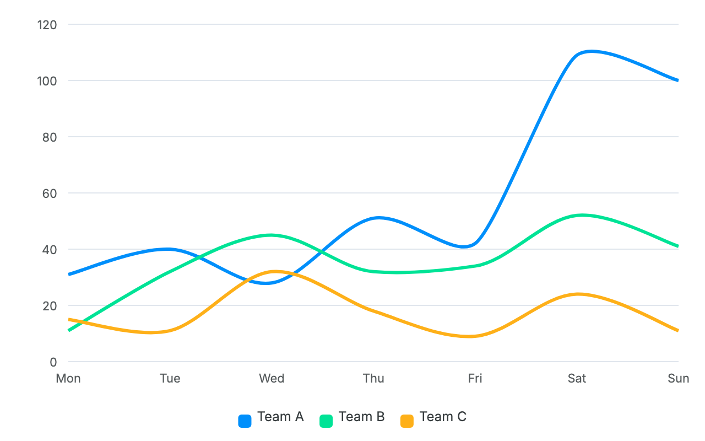
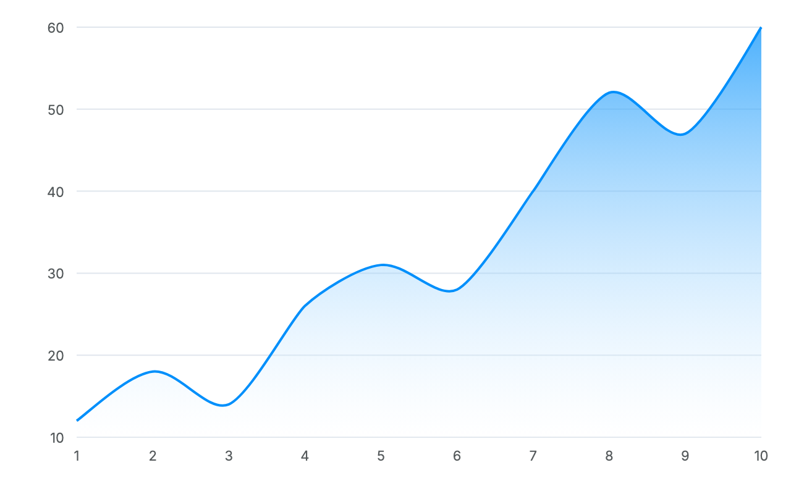
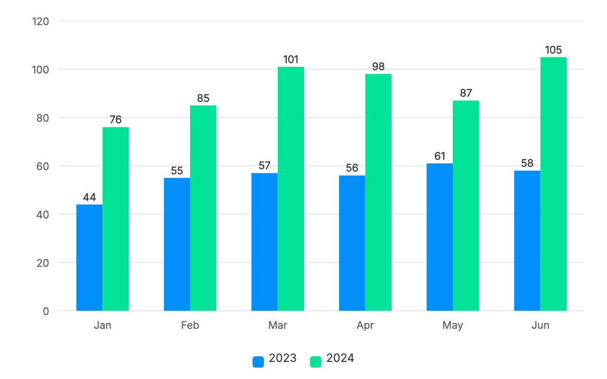
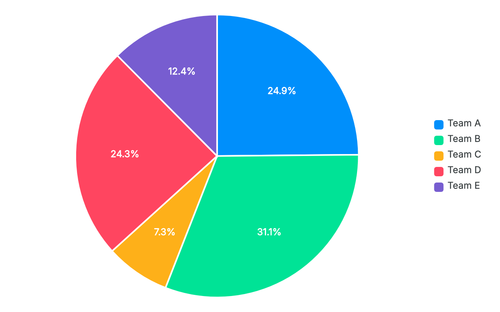
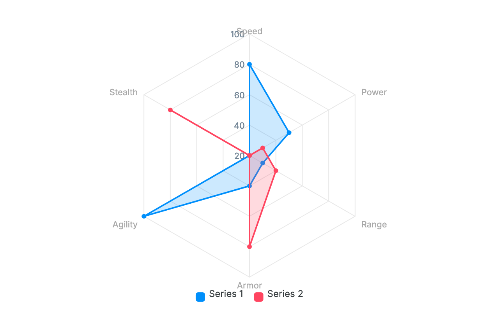
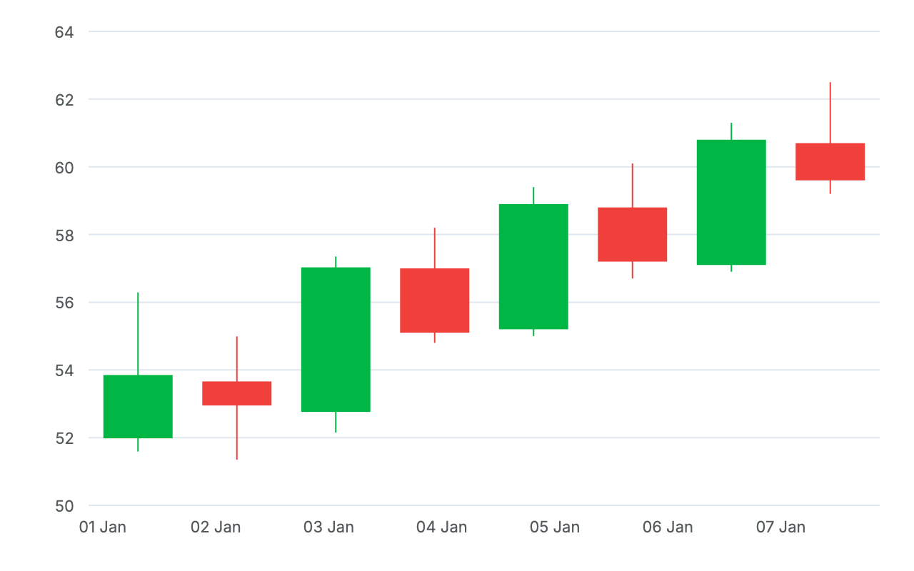
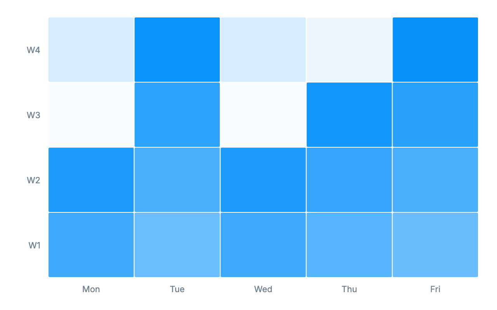
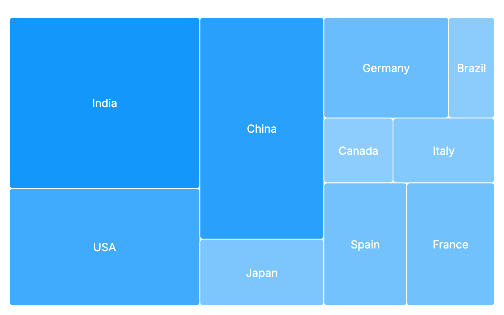

# apexcharts_flutter

A **native Flutter/Dart port of [ApexCharts](https://github.com/apexcharts/apexcharts.js) v4.7.0** — the last release published under the MIT license.

`apexcharts_flutter` reimplements ApexCharts' rendering on Flutter's
`CustomPainter`/`Canvas` instead of SVG/DOM, so it runs natively on **every
Flutter platform — Android, iOS, web, Windows, macOS and Linux** — with **no
WebView, no JS engine, and zero runtime dependencies**.

> 🚧 **Early preview (0.1.0).** The chart rendering is solid and tested, but the
> public API may still change before 1.0. Pin a version and check the
> [CHANGELOG](CHANGELOG.md) when upgrading.

> ⚠️ **Unofficial.** This is an independent, community port. It is **not**
> affiliated with or endorsed by the ApexCharts project. It is based
> **exclusively** on ApexCharts v4.7.0 (MIT); v5+ moved to a non-MIT license
> and is not used here.

## 🔴 Live demo

A web build of the example gallery (all 13 chart types) is published via GitHub
Pages:

**https://eduardoh89.github.io/apexcharts_flutter/**

## Gallery

All rendered natively by `apexcharts_flutter` (no WebView):

| | |
|:-:|:-:|
|  |  |
| **Line** (multi-series, smooth) | **Area** (gradient fill) |
|  |  |
| **Bar** (grouped + data labels) | **Pie** |
|  |  |
| **Radar** (spider) | **Candlestick / OHLC** |
|  |  |
| **Heatmap** | **Treemap** |

…plus donut, scatter, bubble, range bar / timeline and radial bar / gauge —
[see them all live](https://eduardoh89.github.io/apexcharts_flutter/).

## Features

- **13 chart types:** line, area, bar (grouped / stacked / horizontal), pie,
  donut, scatter, bubble, range bar / timeline, candlestick / OHLC, radar,
  radial bar / gauge, heatmap, treemap.
- **Interactive:** tooltips (shared & intersect) on every type, crosshair,
  active markers, drag/wheel zoom + pan with a toolbar and smooth morphing,
  mount animations.
- **Axes:** category / datetime / numeric x-axes, linear & logarithmic y-axes,
  "nice" ticks, value formatters, axis titles.
- **Native everywhere:** pure `CustomPainter`. No WebView, no JS, no platform
  channels.

## Platform support

Because rendering is pure Dart on `CustomPainter`/`Canvas` (no platform
channels, no native plugins, no WebView), the package works on **all six
Flutter targets** with the same code and identical visuals:

| Android | iOS | Web | Windows | macOS | Linux |
|:-------:|:---:|:---:|:-------:|:-----:|:-----:|
|    ✅    |  ✅  |  ✅  |    ✅    |   ✅   |   ✅   |

## Install

```yaml
dependencies:
  apexcharts_flutter: ^0.1.0
```

```dart
import 'package:apexcharts_flutter/apexcharts_flutter.dart';
```

## Usage

The API mirrors ApexCharts' options object, passed as a plain map and parsed
into a typed model:

```dart
import 'package:apexcharts_flutter/apexcharts_flutter.dart';
import 'package:flutter/material.dart';

class Demo extends StatelessWidget {
  const Demo({super.key});

  @override
  Widget build(BuildContext context) {
    return SizedBox(
      height: 320,
      child: ApexChart(
        options: ApexOptions.fromJson({
          'chart': {'type': 'line'},
          'stroke': {'curve': 'smooth', 'width': 3},
          'colors': ['#008FFB'],
          'series': [
            {'name': 'Sales', 'data': [10, 41, 35, 51, 49, 62, 69, 91, 148]},
          ],
          'xaxis': {
            'categories': ['Jan', 'Feb', 'Mar', 'Apr', 'May', 'Jun', 'Jul', 'Aug', 'Sep'],
          },
        }),
      ),
    );
  }
}
```

`ApexChart.fromJson({...})` is a shorthand if you'd rather pass the options map
directly.

### Programmatic zoom (controller)

Attach an `ApexChartController` to drive zoom imperatively — the analogue of
ApexCharts' `chart.zoomX(...)` / `resetZoom()`:

```dart
final controller = ApexChartController();

ApexChart(
  controller: controller,
  options: ApexOptions.fromJson({
    'chart': {'type': 'area', 'zoom': {'enabled': true}},
    'series': [/* ... */],
    'xaxis': {'type': 'datetime'},
  }),
);

// later, e.g. from a button:
controller.zoomX(startEpochMs, endEpochMs); // datetime: epoch ms; else index
controller.resetZoom();
```

On line/area/scatter charts users can also drag-select a range to zoom,
mouse-wheel to zoom about the cursor, and pan — no controller required.

### Chart types

`line`, `area`, `bar` (grouped / stacked / horizontal), `pie`, `donut`,
`scatter`, `bubble`, `rangeBar` (timeline), `candlestick`, `radar`,
`radialBar` (gauge), `heatmap`, `treemap` — selected via `chart.type`, exactly
like ApexCharts.

See [`example/`](example/) for a gallery covering every chart type, zoom/pan,
and a datetime area demo. Or try the [live demo](https://eduardoh89.github.io/apexcharts_flutter/).

## Why a port and not a wrapper?

ApexCharts is a browser SVG library and does not run on Flutter desktop (there
is no macOS WebView). Porting the math + draw logic to `CustomPainter` gives
identical visuals natively on every platform, with no embedded browser.

## Fidelity & method (golden-driven)

The port is validated against the real library: each chart's options are
rendered both by genuine ApexCharts v4.7.0 (headless Chromium via Puppeteer)
and by this package, then compared with a perceptual image diff.

```
fixture (JSON options)
      ├──► ApexCharts v4.7.0 (Puppeteer) ──► reference PNG
      └──► apexcharts_flutter ApexChart  ──► candidate PNG
                                              └─ perceptual diff (tolerance)
```

Parity is **perceptual, not bit-exact**: SVG (Chromium) vs Skia anti-aliasing
always differ slightly at fill edges. Geometry, colors, ticks and data labels
match the reference.

## Licensing

MIT. This package is based **exclusively** on ApexCharts **v4.7.0** (MIT). The
original copyright (© 2018 ApexCharts) is retained in [`LICENSE`](LICENSE)
alongside the port's copyright, as the MIT license requires. See
[`NOTICE`](NOTICE) for the exact upstream tag and commit SHA used.

## Contributing

Contributions are welcome — see [`CONTRIBUTING.md`](CONTRIBUTING.md). In short:
this is a faithful transpilation, so every change should be traceable to the
upstream ApexCharts v4.7.0 source and verified against the real library.

```bash
flutter pub get
flutter analyze
flutter test
```
